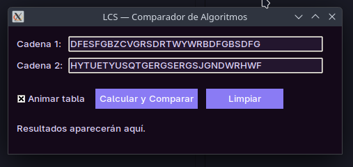

- [1. LCS - Longest Common Subsequence](#1-lcs---longest-common-subsequence)
  - [1.1. Divide y venceras](#11-divide-y-venceras)
    - [1.1.1. Divide](#111-divide)
    - [1.1.2. Conquistar](#112-conquistar)
    - [1.1.3. Combinar](#113-combinar)
  - [1.2. Programación dinamica](#12-programación-dinamica)
- [2. Ejecución](#2-ejecución)
  - [2.1. Librerias](#21-librerias)

# 1. LCS - Longest Common Subsequence
El objetivo es encontrar la subsecuencia más larga que sea común a dos secuencias dadas (por ejemplo, dos cadenas de texto). 

Una subsecuencia es una secuencia que puede derivarse de otra eliminando cero o más elementos sin cambiar el orden de los elementos restantes.

Por ejemplo, para las cadenas X = "AGGTAB" e Y = "GXTXAYB", la subsecuencia común más larga es "GTAB", que tiene una longitud de 4.

## 1.1. Divide y venceras
Este enfoque resuelve el problema dividiéndolo en subproblemas más pequeños de manera recursiva, siguiendo una lógica directa.

### 1.1.1. Divide
Compara los últimos caracteres de ambas secuencias, si los caracteres coinciden, el problema se reduce a encontrar la LCS del resto de las secuencias y añadir 1.

Si no coinciden, el problema se divide en dos subproblemas: encontrar la LCS de (X sin su último caracter, Y) y la LCS de (X, Y sin su último caracter).

### 1.1.2. Conquistar
 Los casos base son cuando una de las secuencias está vacía; en ese caso, la LCS es 0.

 ### 1.1.3. Combinar
 Si los caracteres no coincidían, se toma el resultado máximo de los dos subproblemas.

 ## 1.2. Programación dinamica
 La programación dinámica soluciona la ineficiencia de la versión recursiva construyendo la solución de abajo hacia arriba (bottom-up). Almacena los resultados de los subproblemas en una tabla (matriz) para evitar volver a calcularlos.

 # 2. Ejecución
Para la ejecución del programa, es necesario ejecutar el programa main.py, en donde se encuentra la vista inicial donde se puede colocar la entrada de los datos.

Despues de ingresar ambas cadenas, se presiona calcular y comparar y comienza la busqueda de coincidencias en la cadena.

## 2.1. Librerias
Las librerias necesarias para corre el codigo de tratan de:

    matplotlib
    requests